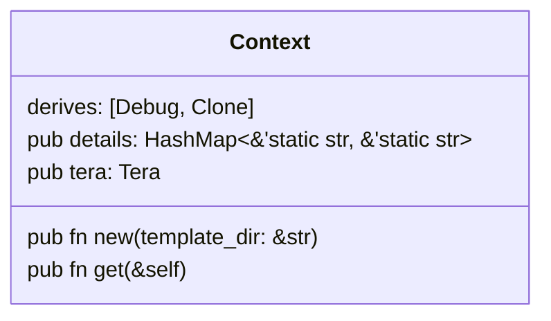

# Tide Template

This is a simple template for new Rust web applications using the crate [tide](https://docs.rs/tide/latest/tide/).

## Structure

### Repo
#### Branches
1. **main**: This is the main branch, intended for the latest stable version of your program.
2. **dev**: This branch is for unfinished/experimental features and changes.
3. **media**: This branch is for storing images to be used in your project's README.

#### Issue Templates
This repo template includes issue templates for bug reports and feature requests:
* [Bug Report Issue Template](.github/ISSUE_TEMPLATE/bug-report.yml)
* [Feature Request Issue Template](.github/ISSUE_TEMPLATE/feature-request.yml)

#### Actions
*GitHub Actions are not yet implemented.*

### Project
#### Front End
This project template uses the templating engine [Tera](https://tera.netlify.app/). Templates including `index.html` are stored in the [templates](./templates) folder, and static files including `main.css` and `script.js` are stored in the [static](./static) folder. Because this is only a template, the files named above are the only front-end files included.

The default style for this project is only slightly opinionated. The default CSS displays the page with a dark theme such that your eyes aren't destroyed right away, and a few CSS reset styles are defined (no margin or padding, `border-box`, and default font-color applied to links).

#### Back End
There are two Rust files that drive the back end of the program.

1. `main.rs`: This is the entry point of the program and where routes are defined.
2. `core.rs`: This is where runtime constants, structs, and functions are defined.

Default runtime constants include `APP_TITLE`, `APP_VERSION`, and `TEMPLATE_DIR`.

The only default struct is `Context`, which is used to track information throughout the program's life cycle.

No default functions are included in this template.
